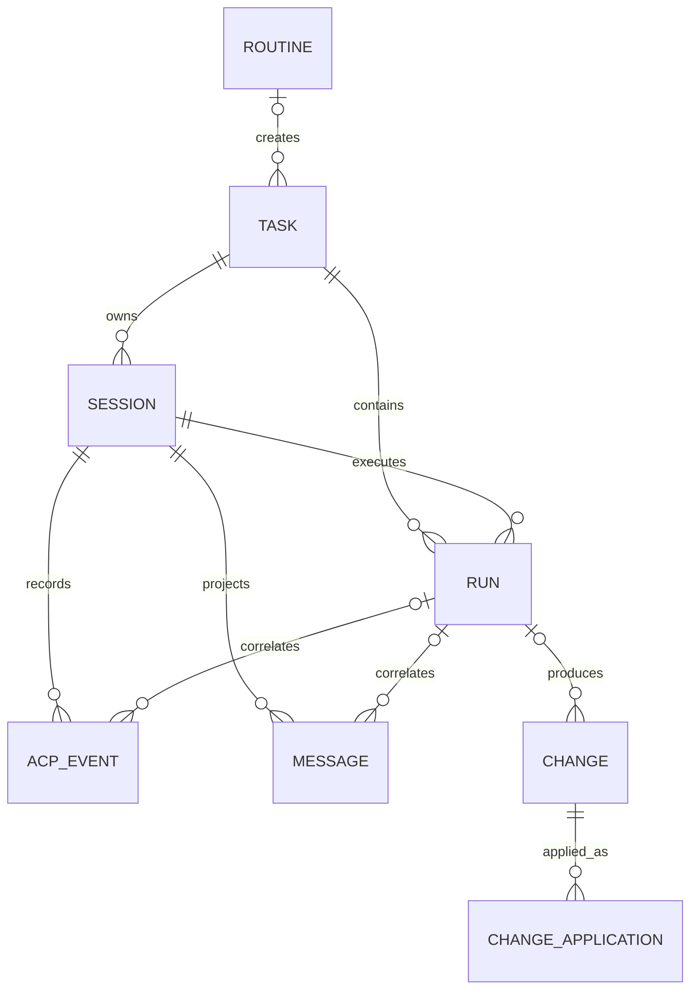
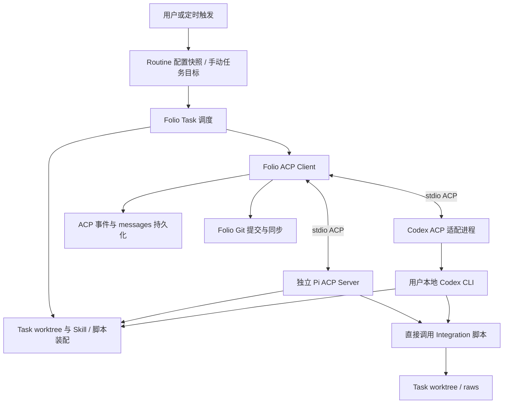

# RFC: Folio Agent Harness 执行与存储架构

- **Status:** Draft — 产品边界已逐项讨论确认，技术方案仍需验证
- **Date:** 2026-09-10
- **Scope:** Routine、Task、Session、Run、ACP、Vault 存储、Git 同步、Integration 装配
- **Related:** [Pi / ACP RFC](./RFC-agent-capability-with-pi-acp.md)、[Sandbox RFC](./RFC-sandboxed-node-runtime.md)
- **实施状态:** V0 的手动 `wiki` Git 外围边界已用真实 Git/SQLite 后端和可脚本化临时探针验证；Agent ACP、自动保存、外部 writer 停止证明等生产执行边界仍在实现中，见 [实现进展](./agent-harness-implementation.md)。历史目录迁移仍不在范围内。
- **首版 Agent 边界:** Agent 在 Task 创建时确定，Task 生命周期内不可切换；一个 Task 的多个 Session 必须使用同一种 Agent。

## 1. Summary

Folio 提供 Agent harness，负责任务调度、环境装配、ACP 通信、执行记录持久化以及 Git 提交与同步。实际工作由内置 Pi Coding Agent 或用户本地安装的 Codex CLI 执行。

Routine 描述可重复执行的工作，按手动或定时触发创建 Task。Routine 不直接调用 Integration，也不理解不同 Integration 的业务参数；它指定 Prompt、Skill、Agent 和需要装配的 Integration。Coding Agent 根据这些指令直接调用 Integration 脚本。

每个 Vault 拥有一个主工作区和 Git 仓库。每个 Task 使用独立 worktree；不同 Task 可以并行工作。Folio 以登记过的 commit 为同步单位，在 main 与任务分支之间自动 cherry-pick。用户通过 diff 查看变化，不需要逐次批准合入。冲突交由原 Task 的独立 Run 处理；raws 不允许通过 AI 改写原始内容来解决冲突。

首期 Agent 默认 full access，不实现等待授权。Skill、脚本装配和 Git 操作约定不是安全隔离；后续通过沙箱落实权限边界。

## 2. 决策状态与既有文档的关系

本文区分三类内容：

- **已确认:** 讨论中明确同意的产品行为与职责边界。
- **建议设计:** 为实现这些行为提出的数据字段、状态和内部职责，尚不是已实现接口。
- **待验证:** 不能仅靠讨论证明的协议、Git、进程或平台行为，必须完成技术验证。

本文是新的 harness 设计依据。与旧 RFC 冲突时，采用本文已确认的决策；旧 RFC 中不冲突的模型凭据隔离、包依赖方向、ACP contract tests 和未来沙箱需求继续保留。

| 主题             | 旧方案或讨论中的中间方案                                 | 本次最终决策                                                          |
| ---------------- | -------------------------------------------------------- | --------------------------------------------------------------------- |
| 文件归属         | 用户内容留在所选目录                                     | 真实内容在 Folio workspace/wiki，用户目录反向链接过去；不考虑历史迁移 |
| 工作目录         | 每 Run 独立 workspace                                    | 每 Task 独立 worktree，多轮 Run 共用                                  |
| 合入             | 用户逐批接受，或只做整批人工合入                         | Folio 按登记的 commit 自动 cherry-pick，用户查看 diff                 |
| Integration 触发 | Integration 主动触发 Task；或 Routine 先调用 Integration | Routine 创建 Task，Agent 根据 Prompt / Skill 直接调用脚本             |
| Integration 入口 | 强制经过 Folio CLI broker                                | 不要求统一入口，直接装配 Integration Skill 和脚本                     |
| Git 写操作       | Agent 自行 commit                                        | Folio 统一 commit、cherry-pick、管理分支与 worktree                   |
| 授权             | 超出预授权范围等待用户确认                               | 首期 full access，无等待授权状态；安全沙箱后续实现                    |
| Pi 运行位置      | SDK 嵌入，与进程安排未明确区分                           | SDK 嵌入独立 Pi ACP Server 进程，不放在 Electron 主进程               |

原 Pi RFC 的 ACP v2 基线不因本文自动变更；Codex 适配是否能满足该基线需要单独验证。不得默认为 Codex CLI 原生支持 ACP。

## 3. 当前代码事实

以下是当前实现事实，不代表本文方案已经落地：

| 现有能力                                                                                                                | 依据                                                                                                                                                                                                                                                                                                                   | 与新方案的差距                                                                                                                                                                                                                                                                                                                                                             |
| ----------------------------------------------------------------------------------------------------------------------- | ---------------------------------------------------------------------------------------------------------------------------------------------------------------------------------------------------------------------------------------------------------------------------------------------------------------------- | -------------------------------------------------------------------------------------------------------------------------------------------------------------------------------------------------------------------------------------------------------------------------------------------------------------------------------------------------------------------------- |
| App 内 Agent 构建与执行入口                                                                                             | [electron.vite.config.ts](../apps/desktop/electron.vite.config.ts)、[agent-runtime.ts](../apps/desktop/src/main/services/agent-runtime.ts)                                                                                                                                                                             | Agent SDK 随 App 打包，使用 Electron Node 模式执行；已移除独立运行包准备，验证详情见 agent-runtime-packaging.md                                                                                                                                                                                                                                                            |
| 新 Vault 注册创建 main workspace/wiki、Git 初始提交和用户入口反向链接；Task 创建、列表与失败重试已接入 RPC 和知识库概览 | [vault-service.ts](../apps/desktop/src/main/services/vault-service.ts)、[task-service.ts](../apps/desktop/src/main/services/task-service.ts)、[TaskPanel.tsx](../apps/desktop/src/renderer/src/tasks/TaskPanel.tsx)                                                                                                    | 新目录必须为空；不迁移历史内容；对话执行入口已接入；Session/Task 固定 Agent 已由服务和数据库共同约束；用户显式完成后的 durable worktree 释放和手动 Task 重开已接入；Routine Task 重开仍暂不允许                                                                                                                                                                                                       |
| 每个 Vault 的 data.db 已初始化执行账本及 ACP 更新/消息投影表，客户端模块已通过 stdio 联调                               | [vault-database.ts](../apps/desktop/src/main/services/vault-database.ts)、[harness-store.ts](../apps/desktop/src/main/services/harness-store.ts)、[harness-event-store.ts](../apps/desktop/src/main/services/harness-event-store.ts)、[harness-acp-client.ts](../apps/desktop/src/main/services/harness-acp-client.ts) | 已接入应用级 Run 调度和消息/工具 UI；已增加解码后 JSON-RPC 双向帧审计；审计关闭等待已接入；Routine 调度已接入；异常字节捕获仍待实现                                                                                                                                                                                                                                              |
| Vault Session 注册表已装入 TaskService，提供打开/关闭 RPC；ACP 与 Pi 历史和全局凭据分开存放                             | [task-service.ts](../apps/desktop/src/main/services/task-service.ts)、[harness-sessions.ts](../apps/desktop/src/main/services/harness-sessions.ts)、[directory.ts](../packages/agent/src/config/directory.ts)                                                                                                          | 打开不发送 Prompt；Pi 显式模型快照与会话配置隔离已接通；停止后的显式 Run 检查/恢复已接入；旧进程仍存活时拒绝接管；下一轮通过持久原生 Session 恢复，不依赖进程长驻                                                                                                                                                                                                           |
| 应用级 Run 调度、停止、退出中断与对话显示                                                                               | [harness-runs.ts](../apps/desktop/src/main/services/harness-runs.ts)、[TaskConversation.tsx](../apps/desktop/src/renderer/src/tasks/TaskConversation.tsx)                                                                                                                                                              | 每条 terminal 路径先关闭 Session 并等待 Folio 所有的 Agent 进程回收，再登记 Run 结果；同步仍独立且 pending；逃逸到 Folio 进程组之外的写入者仍不能证明停止，未自动提交或完成 Task                                                                                                                                                                                          |
| Routine 配置版本、触发快照及 Task 创建已接入 Vault RPC 与概览界面                                                       | [routine-store.ts](../apps/desktop/src/main/services/routine-store.ts)、[task-service.ts](../apps/desktop/src/main/services/task-service.ts)                                                                                                                                                                           | 已验证重试去重、暂停后的旧触发恢复及 worktree 创建失败恢复；已接入编辑、启用/暂停、触发历史、Task 模型默认值和数据库执行互斥；已接通按配置启动首轮及持久化派发身份，新增待触发记录、批次合并与服务层派发入口，以及冲突登记时自动暂停和拒绝重新启用；待触发次数/时间和已合并批次时间已接入触发历史；每日计划、Vault 时区和应用级定时检查已接入；Routine Task 在最终同步/无变化收据后自动完成，scheduler tick 可恢复漏掉的 release |
| Integration 安装状态存放在全局数据库                                                                                    | [integration-store.ts](../apps/desktop/src/main/services/integration-store.ts)                                                                                                                                                                                                                                         | 不应误作 Vault 任务历史数据库                                                                                                                                                                                                                                                                                                                                              |
| 统一 ACP stdio 服务及 Pi / Codex backend                                                                                | [cli.ts](../packages/agent/src/cli.ts)、[server.ts](../packages/agent/src/acp/server.ts)                                                                                                                                                                                                                               | 已接入原生身份归档与精确回放；Vault 事件库和应用 Run 调度已有联调；取消/退出后保留现场，尚无自动提交同步                                                                                                                                                                                                                                                                   |
| Pi Session 已接入原生文件持久化，CLI 配置 ACP replay archive                                                            | [session-factory.ts](../packages/agent/src/pi/session-factory.ts)、[session-archive.ts](../packages/agent/src/acp/session-archive.ts)                                                                                                                                                                                  | 跨进程恢复和空会话模型保留已验证；应用执行入口已接入；显式 Skill 工厂入口已启用，Integration 装配待接通                                                                                                                                                                                                                                                                    |
| Agent 设置可管理 Provider 凭据和查看目录                                                                                | [ModelsSettings.tsx](../apps/desktop/src/renderer/src/settings/ModelsSettings.tsx)                                                                                                                                                                                                                                     | 会话可从已配置 Provider 显式选模型，不改全局默认；原生 Codex 暂用本地模型配置                                                                                                                                                                                                                                                                                              |

## 4. 核心领域模型

### 4.1 Routine

Routine 是可复用的任务定义，包含 Prompt、选用 Skill、Agent、Integration ID 列表和触发计划。

- 不硬编码 Lark 群聊、查询范围或各 Integration 的调用步骤；这些知识属于 Prompt / Skill。
- Integration ID 列表决定向 Task 装配哪些能力，首期不构成访问控制。
- 每次触发生成独立 Task，并保存实际采用的配置快照。
- 修改 Routine 只影响以后创建的 Task。
- 手动 Task 可以不关联 Routine。

### 4.2 Task

Task 是稳定的工作单元，持有目标、任务分支、worktree，以及多个 Session 和 Run。

- Task 创建时固定 Agent；所有 Session、普通 Run、恢复 Run 和冲突解决 Run 都使用该 Agent。
- Agent 不可用时保留 Task 和现场，等待用户在 Agent 恢复可用后重试；首版不自动或手动切换 Agent。需要使用另一种 Agent 时创建新的 Task。
- 一个 Task 可关联多个同 Agent Session，但同一时刻只能有一个 Run 操作它的 worktree。
- 手动 Task 支持多轮对话和多次提交；同步一轮修改不等于完成 Task。
- 冲突解决仍归属原 Task，不创建独立的冲突任务。

### 4.3 Session

Session 是 Folio 管理的 Agent 会话。必须区分：

| 身份                  | 所有者      | 用途                                |
| --------------------- | ----------- | ----------------------------------- |
| Folio Session ID      | Folio       | 数据库关联、展示、生命周期          |
| ACP Session ID        | ACP Server  | prompt / cancel / resume 等协议操作 |
| 原生 Agent Session ID | Pi 或 Codex | 引擎原生持久化与恢复                |

三个 ID 不能假定相同。若原生 ID 未通过适配器暴露，记录为未知，不能使用 ACP ID 伪造。

一个正在执行的 Session 对应独立 Agent 进程。Folio Session、ACP Session 和原生 Session 身份独立于该进程的存活；当前实现会在每轮 Run 进入 terminal 前关闭进程，下一轮以持久原生 Session 恢复多轮上下文。创建或恢复 Session 时必须核对其 Agent 与 Task 固定配置一致，不能通过创建新 Session 绕过该不变量。跨 Agent 上下文交接和原生历史转换不在首版范围内。

### 4.4 Run

Run 表示一次 Prompt 从发送到结束、失败或中断的执行，关联一个 Task 和一个 Session。

建议记录业务执行、恢复、冲突解决三种 Run 用途。每个 Run 保存输入、所用 Session、事件与消息关联、起始 commit、产出 commit、同步结果和错误。

恢复不覆盖旧 Run：在原 Session 中创建新 Run，关联被接续的 Run，先检查已有进展再继续。不直接重放原 Prompt，因为 Integration 或外部操作可能已经执行。



图中的可选 Run 关联允许保存初始化、恢复回放及其他发生在 Run 外的会话事件。CHANGE 也可能来自用户保存，不一定关联 Run。

## 5. Vault 文件与数据库布局

建议的布局如下；除 workspace/wiki、raws 日期目录和 Task worktree 归属外，辅助目录名称属于建议设计。

```text
$FOLIO_CONFIG_DIR/
  config.json                         # 全局注册和非敏感设置
  data.db                             # 现有全局 Integration 安装状态
  agent/                              # 现有 Folio 模型凭据与目录数据
  vaults/{vaultId}/
    config.json
    data.db                           # 此 Vault 的任务、事件、消息和同步记录
    workspace/                        # main 检出目录
      .git/
      .gitignore
      AGENTS.md
      wiki/                           # 真实用户内容
      raws/
        lark-im/{YYYY-MM-DD}/
    worktrees/{taskId}/                # Task 分支；cwd 指向这里
      .git                            # Git worktree 管理文件
      AGENTS.md
      wiki/
      raws/
    sessions/{folioSessionId}/        # 原生 Session 数据，若引擎支持指定位置
    runtime/{taskId}/                 # Skill / 脚本装配元数据、临时运行信息

用户选定的目录 → vaults/{vaultId}/workspace/wiki/
```

### 5.1 已确认规则

- Folio 管理真实文件；用户所选路径是指向 main 中 wiki 的入口。
- 不设计历史目录迁移，不在本文执行目录搬迁。
- Git 跟踪 wiki、raws、AGENTS.md；数据库、凭据、原生 Session、运行临时文件不进入该仓库。
- Agent 的 cwd 是 Task worktree；用户目录看到 main 中已同步的内容。
- 默认假设本机已安装 Git，实际可用性仍须在启动执行前检查。
- AGENTS.md 由 Folio 初始化模板，后续由用户维护并提交；Routine Prompt 和 Integration 装配不反复改写它。

### 5.2 尚需验证或细化

- 原生 Session 能否放入指定目录，尤其 Codex 使用本地安装和用户认证时的存储行为。不能为了统一目录而复制或搬移 Codex 用户数据。
- Skill / 脚本如何被 Pi 和 Codex 发现、如何避免这些链接或临时文件进入 Git；以适配层实际支持为准。
- Windows 链接实现、路径权限、打包后的 Node 运行时。
- 日期目录使用哪个时区；raws 文件命名、远端消息 ID、分页与去重规则属于 Integration 契约，不由 Routine 猜测。

## 6. 执行架构与 ACP



这是一张职责图，不承诺 Codex 适配的进程数量和启动参数。实际适配方式属于技术验证项。

### 6.1 运行顺序

1. 创建 Task，保存 Routine 配置快照或手动输入。
2. 从 main 的已登记提交创建任务分支和 worktree，装配选用 Skill / Integration。
3. 启动 Session 的 Agent 进程，初始化 ACP；记录会话 ID 映射。
4. 创建 Run，保存输入与执行基线，通过 ACP 发出 Prompt。
5. Agent 按 Skill / Prompt 自行调用 Integration 脚本，生成 raws，编辑 wiki。
6. Folio 持续保存 ACP 事件并构建 messages，向 UI 展示进展。
7. Agent 本轮执行结束且相关脚本退出后，Folio 提交 raws，再处理 wiki 的提交与同步。
8. 手动 Task 回到可继续对话状态；Routine Task 在所有提交同步成功后自动完成。

ACP prompt 的响应不能被当作执行完成。在现有 v2 约定下，它只确认接受；最终状态由 session update 决定。也不能把 Agent 的文本“完成了”当作机器完成信号。

### 6.2 Run 结束与脚本退出

没有统一脚本入口时，Folio 不能仅靠文件变化判断 Integration 调用完成。

- 已确认只在轮次结束、相关脚本退出后提交；执行中不抢先提交 raws。
- ACP 前台 idle 不覆盖任意底层后台工具。当前每条 Run terminal 路径都会先关闭 ACP Session、回收 Folio 所有的 Agent 进程并等待退出，然后才登记 terminal outcome；这只证明 Folio 所有的进程边界。
- 首期需要 Skill 明确禁止留下写入任务目录的后台脚本，并验证适配层的工具完成语义；约定不能被当成进程隔离证明。
- 工具若故意逃逸到新的进程组，或外部编辑器在 clean preflight 后继续写入，仍无法确认停止；此时保留现场，不宣称已安全提交或完成 Task，后续由 sandbox 收紧。

### 6.3 进程与应用生命周期

- 关闭窗口：Run 继续执行。
- 明确退出 Folio：停止执行、释放 Agent 进程及相关资源；未完成 Run 记为中断，保留 worktree。
- 再次启动：不自动重放未完成 Run，由用户恢复。
- 正常退出应先请求取消并等待清理；超时终止、子进程树回收和异常崩溃恢复需适配器测试。
- Codex 0.153.4 原生实验已确认：前台取消可以终止正在写入的命令，但 Turn idle 和 app-server 退出都不能单独证明后台终端停止。适配器关闭前已调用原生 `thread/backgroundTerminals/clean`，并验证受其管理的长命令退出；自行脱离管理的进程、异常断连及其他平台仍待验证，不能由此放开自动提交或同步。
- 独立进程用于故障隔离，不代表 OS 安全沙箱。
- 当前每轮 Run 的 terminal 路径都会回收 Session 进程；持久化会话身份独立于进程存活，后续 Run 通过 Session resume 继续对话。

## 7. Integration、raws 与 full access

### 7.1 职责

| 对象          | 职责                                              | 不承担                                  |
| ------------- | ------------------------------------------------- | --------------------------------------- |
| Routine       | 选择 Agent、Prompt、Skill、Integration ID 与计划  | 各 Integration 的参数模型和执行流程     |
| Folio harness | 装配资源、启动 Agent、记录 ACP、处理 Git          | 强制将脚本调用改写成统一 CLI broker     |
| Integration   | 提供 Skill、脚本、认证和数据获取能力              | Agent 生命周期、worktree 与 Git 同步    |
| Coding Agent  | 理解指令、直接调用脚本、整理 wiki、处理允许的冲突 | 按约定不执行 Git 写操作、不改写原始资料 |

### 7.2 raws 的约定

- Agent 可以调用 Integration 脚本生成 raws，但不应自行改写原始内容。
- Folio 在 Run 安全结束点，把 raws 与 wiki 分开提交。
- raws 同内容可去重；同路径不同内容应保留双方版本或暂停，不让 AI 任意选择“正确版本”。
- 并发写同一天目录时，应由 Integration 使用稳定且不冲突的文件身份；不能靠 AI 合并两个原始 JSON 来代替源数据去重。
- 在没有 broker 和沙箱的情况下，Folio 只能知道路径发生了变化，不能据此证明某文件一定由某脚本产生。原始数据来源标记与不可篡改保证不是一回事。

### 7.3 首期授权

Agent 默认 full access，Task 不存在等待授权状态。适配器应显式配置并验证此模式；不能未经确认就让某种 Agent 意外停在不可见的权限询问中。

Routine 的 Integration 列表是资源装配清单，不保证 Agent 无法访问其他安装、文件或网络。Git 写操作由 Folio 负责也是首期协作约定，尚无强制权限防线。检测到 Agent 或外部工具绕过约定写入 Git 时，按外部提交流程暂停同步。

后续沙箱再落实文件、进程、网络和凭据访问边界。不会因 full access 就把凭据主动放入 Git、Prompt 或 renderer 配置快照。

## 8. ACP 事件与 messages 存储

### 8.1 两层记录

每个 Vault 的 data.db 同时保存：

1. 原始 ACP 事件：用于排错、审计和重新构建展示记录。
2. 归一化 messages / 工具记录：将 chunk、upsert 和状态更新整理为 UI 可读取的数据。

Folio 保存自己发送的用户输入，以及 Agent 消息、工具调用与结果、权限协议事件（即使首期自动处理）、执行状态和协议错误。原生 Agent Session 数据另外保留；ACP 历史不是原生推理状态或完整上下文的替代物。

### 8.2 建议字段与约束

| 记录                | 建议保存的主要内容                                                                        |
| ------------------- | ----------------------------------------------------------------------------------------- |
| routines            | Vault 归属、Prompt、Agent 选择、Skill / Integration 引用、计划、启用与暂停状态            |
| tasks               | Routine 可选关联、实际配置快照、目标、分支/worktree、生命周期、完成/保留原因              |
| sessions            | Task、Agent 类型、Folio / ACP / 原生 ID、适配器版本、恢复信息                             |
| runs                | Task、Session、Prompt、用途、接续 Run、开始/结束时间、执行与同步结果、基线                |
| acp_events          | Session、可选 Run、本地顺序号、连接代次、方向、方法、request ID、载荷、接收时间、协议版本 |
| messages            | Session、可选 Run、协议消息 ID、角色、内容块、完成状态、事件投影位置                      |
| tool_calls          | Session、可选 Run、toolCallId、输入、结果、状态与事件关联                                 |
| changes             | 稳定变更 ID、来源、可选 Task/Run、原提交、变更类型与路径                                  |
| change_applications | 变更 ID、目标分支、目标基线、应用后 SHA、状态、冲突解决 Run                               |

这些是逻辑记录，不要求每项立即建立一张独立表。最终 Schema、索引、事务边界由实现前的最小用例确定。

建议先将事件和可恢复的投影进度提交到数据库，再发布 UI 更新。消息身份至少按 Session 区分，不能假定不同 Agent 的 messageId 全局唯一。

### 8.3 重放、崩溃和敏感内容

- 为入站事件分配本地顺序号只能证明本地顺序，不能证明重连后重放事件是新事件。
- 必须验证 ACP resume / replay 的实际语义，尤其 chunk 重放是否会重复拼接；不能凭空假定协议存在 event ID 或 resume cursor。
- 用户 Prompt 已发送但响应未持久化时，恢复不能盲目再次发送；保留结果不确定状态并读取会话现场。
- “原始事件”是指保留协议语义，不意味着记录连接凭据或授权 Header。请求和响应的敏感字段需要明确脱敏边界。
- Agent full access 时，工具输出本身可能包含敏感内容；无法声称事件库天然不含秘密。大小限制、附件外置和数据保留策略待细化。

## 9. Git 提交与自动同步

### 9.1 已确认的不变量

- main 是用户可见的已同步内容；Task 在自己的分支/worktree 中执行。
- 未保存、未提交的内容不参与同步，不能用 reset --hard 或直接覆盖强行同步。
- 用户在 Folio 中保存时产生用户提交；Agent 编辑由 Folio 在执行边界提交。
- Folio 统一执行 commit、cherry-pick、分支及 worktree 管理；Agent 可读 status/diff。
- Run 结束先提交 raws，再处理 wiki，保持原始输入与整理结果可追溯。
- Folio 串行更新 main；更新任务 worktree 时必须等它没有正在运行的 Run/工具且工作区干净。
- main 有变化后必须同步到任务 worktree，但在执行安全点进行，不改变正在运行的工具所读取的文件。
- 失败和中断时保留未提交现场，不能为了同步或清理而丢弃。

### 9.2 同步顺序：已确认采用统一冲突结果

2026-09-10 用户确认采用 [canonical Git 同步方案](./git-sync-canonical-proposal.md)。该决策取代原双向分别解冲突的顺序。2026-09-11 已实现手动 `wiki` 保存的生产后端切片、main 前进后旧准备的 durable reprepare、人工解决/放弃 coordinator 的 durable 收据、terminal receipt 前的 Folio-owned Agent 进程回收、受约束的 conflict-resolution Run，以及由用户显式选择文件的 Run wiki 保存和同步状态投影。Run 结束自动保存，以及逃逸进程/外部编辑器的 writer quiescence 仍未完成。

1. 持久化操作身份、main 基线、Task 已接纳 frontier、冻结 HEAD 和完整已登记源提交区间。
2. 在基于 main 的隔离协调 worktree 中依次 cherry-pick；冲突只解决一次，不把 main 留在冲突状态。
3. 取得 Vault 发布锁并复查基线和工作区，以 fast-forward 发布；main 已前进则重新准备。
4. 完整源区间均已接纳后，等待 Task 无运行工具、HEAD 未变且工作区干净，用普通子提交对齐 canonical tree，保留原历史和可查看 diff。
5. 分别登记 main 发布、Task 对齐和同步收据。新 main 变化继续排队，不将旧检查点视为追上当前 main。

同一 Task 如果已有更新的未完成同步操作，旧 publication 不得先移动 Task；必须由最新操作发布并对齐完整结果。即使源区间为空，canonical checkpoint 一旦完成也不可改写。alignment 的 Git 写入先于数据库收据成功时，恢复同样必须核对确定性 commit 字节和受保护 ref，不能只凭 Task HEAD 补记完成。

Git 与 SQLite 没有共同事务，必须实现操作日志及逐检查点恢复；详情和现有实验的限制见上述方案。

### 9.3 稳定变更 ID 与 cherry-pick 风险

cherry-pick 产生新 SHA。Folio 为逻辑变更生成稳定 ID，并登记它在 main 和各任务分支上的实际提交，避免仅凭 SHA 重复同步。

**变更 ID 只能解决身份追踪，不能证明补丁语义相同。** 尤其以下场景必须验证：

- main 的修改 pick 到任务分支后，任务的原提交再 pick 回 main，如何避免双方已整合的内容重复应用。
- 同一逻辑变更在两个分支上经过不同冲突解决后，最终内容不同，如何记录补充解决变更。
- 任务重开、分支删除重建后，账本如何判断基线已经包含哪些变更。
- 同路径文件 rename/delete 与文本修改交错，多个任务同时修改相同文件。
- Git 操作成功但数据库写入失败，或数据库已记为进行中但进程崩溃。

实现前必须用小型真实 Git 仓库证明内容收敛和幂等。若双向 cherry-pick 无法可靠满足这些规则，需回到设计讨论修改算法，不能悄悄改成覆盖或绕过登记。

### 9.4 用户修改与外部 Git

- 已确认用户修改由用户保存并产生 commit，不做闲置文件监控自动提交。
- 外部编辑器写入磁盘不等于 Folio 已登记的保存提交。Folio 检测到未提交修改时等待用户在 Folio 中保存/提交，不自动覆盖。
- 外部 Git 产生未登记的提交时暂停自动同步，用户明确接纳并登记后继续。
- 用户点击保存的 UI 已限定为显式选择的 `wiki/**` 文件；不能把其他未确认文件一并 git add -A。
- 用户打开但尚未保存的编辑器缓冲区，Git 无法看到；main 同步后的重新载入/冲突提示需编辑器集成处理。

### 9.5 冲突解决

- 仍归属原 Task，创建独立的 conflict-resolution Run；不能与该 Task 的正常 Run 并发。
- 提供共同基线、双方 diff、冲突文件和任务目标，由原 Agent 编辑冲突结果。
- Folio 负责验证、完成 cherry-pick 和记录提交；Agent 不自行操作 Git 写命令。
- wiki 允许 AI 解决后自动继续；raws 仅允许无损去重或保留双方版本，否则暂停。
- 检查失败或 Agent 无法解决则保留现场。检查内容需要按产物类型定义，不能把“无文本冲突”当作业务正确。
- 不应在 main 中留下持续的 Git 冲突状态等待 AI，阻塞所有同步。建议使用隔离的协调目录或等价机制准备解决结果，基线复查后再更新 main；具体方式待 Git 验证。
- 暂停原任务的同步不妨碍其他 Task 执行；对 main 的最终写入仍串行。
- 当前后端在 conflict 等待期间发现 main 已前进时，会先持久化已暂存的 resolution input；`tasks.reprepareWiki` 在新 main 上通过 replacement operation 和三方 patch 重放，重放冲突则保留新的 coordinator，不会自动 abort 或覆盖解决稿。
- durable replay 在重新应用前复核 source/parent/tree 身份、Git 对象和暂存路径范围；损坏或越界的持久化 patch 会拒绝继续，不会写入非 `wiki/**` 文件。main 在此期间新增的无关文件允许保留。

用户可查看每次变更与冲突解决的 diff。撤销已传播提交的方式尚未确定；不能把硬重置当作已批准的撤销方案。

## 10. 生命周期与调度

### 10.1 Routine 重叠与失败

- 同一 Routine 不重叠执行，运行期间的触发合并为一次待执行。
- 前一 Task 结束后，使用当时的 Routine 配置创建下一 Task；合并触发的时间记录应保留。
- 不同 Routine 和手动任务可以并行。
- 普通执行失败：保留失败 Task 和现场，不阻塞该 Routine 下一次创建 Task。
- Git 同步冲突尚未解决：暂停该 Routine，不继续堆积待合入修改。
- 普通失败 Task 的未提交内容不会自动成为下一个 Task 的输入；已同步到 main 的内容会继承。
- 恢复旧失败 Task 时仍应遵守同 Routine 不重叠执行。
- 首版计划为每天指定时间，使用 Vault 保存的时区。应用关闭或休眠期间错过的触发，恢复后合并补跑一次（2026-09-10 用户确认）。

### 10.2 Task 完成与 worktree 清理

| 场景                                | 行为                                                    |
| ----------------------------------- | ------------------------------------------------------- |
| 手动 Task 合入一轮                  | 保留 worktree，可继续对话                               |
| 用户明确完成手动 Task               | 停止进程，确认修改已处理后删除 worktree                 |
| Routine Task 成功且所有提交同步完毕 | 自动完成，删除 worktree                                 |
| 普通失败、中断、未处理同步冲突      | 保留 worktree 与执行记录                                |
| 完成时有未提交或未同步修改          | 不直接删除；用户处理或明确丢弃后才能清理                |
| 重新打开已完成 Task                 | 基于当前 main 重建，优先复用原路径；通知 Agent 基线变化 |

删除 worktree 不删除 messages、原始事件、会话 ID 关联和提交记录。原生 Session 的保留/清理也必须独立处理。首期不做闲置 worktree 自动清理；失败任务因此可能累积，需在 UI 中可见。

当前后端已实现用户显式完成：先拒绝 active Run 和尚未获得 `completed`/`not-required` 同步收据的成功 Run，再关闭该 Task 的 Folio-owned live Sessions；只有 worktree 干净、身份有效且 Task/main tree 一致时，才以 `releasing → released` durable checkpoint 删除 worktree。Git 删除已成功但 SQLite 收据丢失时可重试恢复；分支、Session、Run 和 messages/history 保留。Routine Task 只在按数据库单调 sequence 判定的最后一个 Run 成功、且所有成功 Run 都获得同步或无变化收据后复用同一完成路径；失败/中断/取消的最后 Run 保留现场。若应用在 receipt 与 release 之间退出，scheduler tick 会重试 active 以及 `completed/releasing` 状态；后置 release 失败不改写或掩盖原 receipt RPC 的成功结果。用户正在检查现场的 live Session 会让自动回收跳过，显式完成仍可关闭它；Session 启动与完成共用 admission gate，避免 completion 已关闭旧 Session 后再启动新进程。手动 Task 的重开已接入：要求已释放、无残留 checkout、main 干净且基线已登记，在当前 main 上重建同一分支/worktree，并以受保护 ref 保留旧分支头。新 `worktree_base` 同时成为下一轮同步前沿，历史 `aligned` operation 保留审计但不会让其他 Task 已发布到 main 的提交再次被当作本 Task 来源；Routine Task 重开仍暂不允许。

### 10.3 建议状态建模

避免一个状态字段同时表达执行、同步和资源情况。建议分别记录：

- Task 生命周期：待执行、活跃、完成、取消；失败/中断现场是否需要处理另行标记。
- Run 执行：准备、运行、成功、失败、中断、取消。
- 同步：无需同步、待同步、进行中、冲突、完成、失败。
- Routine：启用/暂停、当前 Task、是否有合并的待触发。
- worktree：存在、待清理、已释放。

状态名称是草案。不存在首期等待授权状态；“Run 成功”也不自动意味着“Task 完成”或“同步成功”。

## 11. 实现前技术验证与交付顺序

以下是建议拆分，不是本次已经开始实施的任务。

### V0 — 两个必须先验证的边界

1. **真实 Git 同步实验:** 两个任务分支和 main 双向 pick；覆盖重复投递、不同冲突解决、rename/delete、用户未提交修改、外部提交和 Git/DB 崩溃窗口，证明内容收敛与可恢复。
2. **真实 Agent ACP 实验:** Pi 与本地 Codex 的 initialize、prompt、流式消息、工具、取消、full access、原生 Session 持久化、进程重启恢复、cwd 固定和 worktree 重建。记录协议差异，不假定已有适配兼容。

V0 不通过时重新讨论设计，不把问题留到自动同步上线之后。

### V1 — Vault 与持久化基础

新 Vault 建立主仓库、wiki 与反向链接；Task worktree 生命周期；Vault 数据库中的领域记录；本地 Git 存在性检查。历史迁移不在范围内。

### V2 — 最小手动任务

一个 Agent、一个 Task、多轮 Run；ACP 原始事件与 messages；退出中断与用户恢复；默认 full access；Folio 统一提交。先验证没有丢文件、重复消息或误重放。

### V3 — 提交同步与并发

按 V0 验证后的算法实现变更登记、自动 cherry-pick、安全点同步、独立冲突 Run 和启动恢复。通过 Git 内容断言验证，不能只测方法被调用。

当前先验证一个缩小切片：不启动 Agent、不装配 Skill、不调用 Integration，也不处理 `raws`；直接手动修改 Task worktree 的 `wiki` 文件，再验证 Folio 提交、隔离 canonical 准备、main 发布、Task 对齐及各并发拒绝边界。该切片已完成真实 Git/SQLite 回归和可脚本化临时探针复验；手动提供“写入者已停止”只是一项实验前置条件，不能替代生产中的进程所有权或停止证明。

该切片已有 durable `git_sync_operations` 状态机和真实 Git 实现：冻结完整已登记源区间，在隔离 worktree 生成确定性 canonical commit，保护对象引用，复查干净且未前进的 main 后发布，再用普通子提交对齐未变化的 Task。Git 写成功而数据库收据丢失时可按确定性 commit 恢复；未完成同步会阻止 Session/Run 和 worktree 执行准入。其他 Task 推进 main 后，旧 Task 必须先执行一次显式空源同步，不能直接继续执行。

当前已提供 renderer 可调用的 Task wiki 变更/差异查询，以及显式保存、Run 来源显式保存、无 wiki 变化确认、同步、过期准备替换、冲突解决/放弃和同步收据查询 RPC；调用方必须保留各自的稳定操作 ID，重试不会另建提交或重复同步。`tasks.saveRunWikiFiles` 接受同一 Task 中一个或多个成功且仍待同步的 Run，由用户明确选择共同产生的 `wiki/**` 文件；进入 main 后对 Run ID 排序去重，以不可修改的关联表和重复 `Folio-Run-Id` trailer 保存完整来源。同一 Run 的 wiki 来源只能被一个保存批次认领；只有 canonical operation 真正进入 `aligned` 才把该批次全部 Run 的 `syncState` 记为 `completed`，prepare、conflict、resolve 和 abort 分别投影为 `syncing`、`conflict`、`syncing` 和 `failed`。成功 Run 也可由用户逐个显式调用 `tasks.confirmRunWikiUnchanged`：只有 Task HEAD 仍等于该 Run baseline、没有 tracked/untracked `wiki/**` 变化且没有未完成保存意图时，才把同一 Run 持久化为 `not-required`；该 Run ID 即幂等收据，完成并释放 Task 后仍可重试。Task 查询只解析 Vault 自有 worktree 且只返回 `wiki/**`，不会暴露 `AGENTS.md` 等其他 Task 草稿。main 在 prepare 后被其他 Task 推进时，旧操作以 `superseded` 终态保留，其 canonical ref 不删除；替代 operation 在同一 SQLite 事务登记并复用原冻结源区间，再基于新 main 准备。`reprepare` 同时要求 Task 与 operation 身份匹配，不能用同 Vault 的另一 Task 操作收据。冲突解决只接受 coordinator 中已经完全暂存、无未合并项、无未暂存/未跟踪文件且仅包含普通 `wiki/**` 文件的结果；每个 canonical prefix 在继续下一 source commit 前写入确定性 commit、SQLite 日志和受保护 ref。多次冲突可沿同一 operation 顺序解决，重启及 Git/SQLite 收据丢失会复用已接纳结果；显式 abort 只删除隔离 coordinator 并保留历史，允许新 operation 从原冻结 source 重试。任何 coordinator 清理前必须重新验证路径、`.git`、shared repository、detached HEAD 和 operation checkpoint，身份不符时保留目录并拒绝。Run terminal receipt 只在 Folio 所有的 Agent 进程退出后登记，不会自动保存；renderer 现在支持普通 Task 保存、成功 Run 来源保存、逐 Run 无变化确认和页面刷新后的稳定 intent 恢复。逃逸进程或外部编辑器可能在 clean preflight 后再次写入，Git 与 Folio 锁不能提供停止证明。

2026-09-11 已完成一次排除 Agent、Skill、Integration 和 `raws` 的手动文件边界验证。临时真实 Git 探针与生产 RPC/SQLite/Git 用例共同证明：新 Vault 的用户入口反向链接、Task worktree、手写 `wiki/**` 文件的变更枚举和 diff、按文件保存、隔离 canonical 准备、main 发布、Task 对齐、稳定 ID 重试及最终 tree 收敛可以闭环；连续多个 Run 的共同文件也能由一个显式保存批次完整归因并一起投影同步结果。未选择的 staged/working draft 会保留，`AGENTS.md` 不会被 Task wiki 查询或保存带入。dirty main、Task 新草稿、未登记外部 commit、main 并发前进、重复认领 Run 和 coordinator 身份异常都会拒绝继续而不覆盖现场；同文件冲突只留在 coordinator，可由人工完整暂存后继续，并覆盖 Git 已成功但 SQLite 收据丢失的恢复窗口。验证命令和最新计数记录在 [实现进展](./agent-harness-implementation.md)。

隔离 coordinator 的 checkpoint 恢复不使用 `reset --hard`：服务会先重新验证 shared、detached、operation-owned 身份，拒绝任意未跟踪文件，再用 `git restore --source <commit> --staged --worktree -- .` 恢复已登记树，最后只更新 detached `HEAD`。该路径不能作用于 main 或用户 Task worktree；coordinator 清理同样必须先通过身份复核。

这次结论覆盖“外部写入者已经停止后，Folio 接管手动 wiki 文件”的外围闭环，以及受约束的 AI conflict-resolution Run 后置接纳。它没有证明普通 Agent 结束时自动保存、逃逸子进程或外部编辑器的停止性，也不把 Skill、Integration 脚本、`raws` 或 Agent 切换纳入当前完成范围。

Task worktree 的文件选择、差异预览、显式保存和同步入口已接入 renderer；查看差异不会自动提交文件，保存、同步、reprepare 和 conflict 请求的非敏感重试元数据会按 Vault/Task 隔离保存在当前应用会话的 `sessionStorage` 中。刷新后仍须通过服务端 durable receipt、Task HEAD 和文件范围校验，文件选择状态及任何文件内容不会恢复。

显式 `tasks.complete` 也已接入：先关闭该 Task 的 Folio-owned Sessions，再要求所有成功 Run 已同步或明确无需同步、worktree 干净且 Task/main tree 一致，之后才 durable release。分支及 Task/Session/Run/messages 历史保留；手动 Task 可通过 `tasks.reopen` 在当前 main 上恢复 checkout，并以新 main 基线继续手动保存/同步，Routine Task 重开仍是后续 TODO。

### V4 — Routine 与 Integration 装配

Routine 快照、Skill / 脚本挂载、raws 提交边界、定时触发合并、普通失败与同步失败的不同策略、自动完成清理。

Skill 选择和 `raws` 契约暂不作为当前外围 Git 闭环的前置条件；在手动 `wiki` 修改闭环及其恢复日志通过后再继续。

### V5 — 第二种 Agent 的协议对齐与未来沙箱

补齐另一种 Agent 的同等协议契约，使新 Task 可以在创建时选择 Pi 或 Codex；不支持存量 Task 切换 Agent。沙箱作为后续独立能力引入，不宣称首期已经隔离。

## 12. 待继续确认的问题

已确认的产品规则不在这里重复询问。以下仍需证据或后续设计：

1. Run 结束后选定 `wiki` 的显式保存和同步后端已能保留一个或多个 Run 的完整来源并投影同步状态；无文件变更的成功 Run 也已有逐 Run 的显式 `not-required` 收据；Task 文件选择/差异 UI 已接入。terminal receipt 已位于 Folio-owned Agent 进程回收之后，但逃逸进程和外部编辑器仍需 sandbox/所有权边界，不能只用 ACP idle 代替停止证明。
2. conflict-resolution Run 的 terminal receipt 与后置 Git 接纳之间依赖稳定重试；当前已为 conflict/resolving 状态保存不可变的 resolution input，并可在 main 前进后创建 replacement operation，使用三方 patch 自动重放，且回放前校验 source/parent/tree 身份和 `wiki/**` 范围。重放再次冲突时会重新进入隔离 coordinator。publish receipt 和 alignment receipt 丢失的接纳窗口崩溃注入覆盖、稳定 reprepare 的 UI 状态恢复，以及冲突 Run 消息嵌入文件面板均已完成；仍需收尾重放后多次冲突的用户交互。
   2026-09-11 更新：稳定 reprepare 的 UI 状态恢复、冲突 Run 消息嵌入文件面板，以及 publish/alignment receipt 丢失后的接纳重试覆盖均已完成；本项剩余为重放后多次冲突的交互收尾。
3. clean preflight 后外部编辑器再次写入的竞态、外部 Git 接纳流程、未保存缓冲区协调和撤销已同步变更的语义。
4. ACP 流式记录的重放去重、子进程退出确认、原生 Session 与 UI 记录的一致性。
5. raws 日期、幂等命名与不可改写冲突契约；当前同步实现明确不处理 raws。
6. 原生 Session、事件和失败 worktree 的保留策略；全局并发上限。正常 Run 已逐轮回收 Agent 进程，不等于已解决任意逃逸子进程。
7. 初始 Agent 模型选择已按 Agent 配置承载：Task 创建时固定 Agent，Pi 使用显式 provider/model 快照；Codex 仍沿用本地配置适配，后续补齐统一模型配置体验，不允许用默认字段掩盖缺失配置。
8. AGENTS.md、除 raws/wiki 外的新文件如何分类提交，以及业务产物的检查标准。

下一轮优先补齐重放后再次冲突的交互收尾；第 1 项的 Task 文件选择 UI 已完成，但 terminal receipt 后的 writer quiescence 仍需 sandbox/所有权边界，不能把它描述为自动同步闭环。

### 2026-09-11 实现状态补充：conflict-resolution Run

`tasks.startConflictResolution` 已将隔离 coordinator 接入原 Task 的独立 conflict-resolution Run：复用原 Agent/model snapshot，cwd 固定为 `sync-worktrees/{operationId}`，Prompt 携带 Task goal、共同基线、双方 diff 和冲突文件；Agent 只能编辑 `wiki/**`，成功 terminal 后 Folio 自动验证、暂存并继续 publish/align，失败或取消保留现场。稳定 Run/RPC ID 重试不重复 Prompt。剩余工作是 terminal receipt 与后置接纳之间的崩溃窗口、稳定 reprepare 的 UI 状态恢复，以及重放后再次冲突的用户交互入口。

稳定 reprepare 的 UI 恢复现已覆盖；当前剩余的是 terminal receipt 与后置接纳之间的崩溃窗口，以及重放后再次冲突的用户交互收尾。
