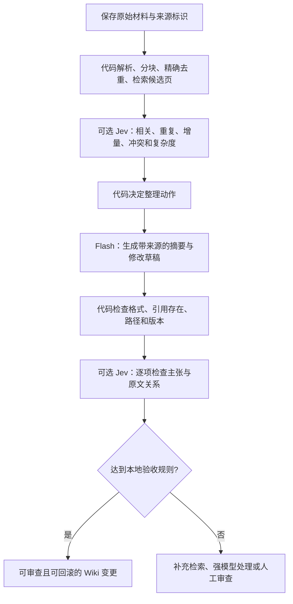

# System One + Flash 用于个人 Wiki 的可行性研究

研究日期：2026-09-19。范围：TypeSafe 官方文档、模式和示例；未调用付费推理 API，未做中文 Wiki 实测。以下把官方描述与工程建议分开；价格、版本、限流是查询时快照。

## 结论

**可以把 Jev 作为个人 Wiki 的语义决策和校验层，配合 Flash 类生成模型完成大量常规整理；归纳正文仍由生成模型完成。** 分类、候选去重、选择目标页面、判断原文是否支持摘要中的一句话，都能化成 Jev 的有限选项或评分。跨来源综合、新概念命名、文章写作、复杂冲突解释仍需要生成模型，有些还需要更强模型或人判断。

目前证据支持这种架构值得实验，不支持“Jev + 任意 Flash 就足够替代强模型”。建议先建立 **Flash + 确定性校验** 基线，再加入 Jev，比较是否减少错误与强模型调用、是否抵消额外调用和维护成本。对于个人低吞吐使用，架构复杂度可能比推理费更重要。

## 已核实的产品事实

| 项目         | 官方说明                                                                                                                                                         | 对 Wiki 的含义                                                       |
| ------------ | ---------------------------------------------------------------------------------------------------------------------------------------------------------------- | -------------------------------------------------------------------- |
| 产品性质     | System One 是一类快速结构化决策模型；Jev 是首个实现。读自然语言，返回 typed decisions 和 probabilities，不生成正文、代码或推理解释。[1]                          | 能判断“是否合并”，不能写出合并后的 Wiki。                            |
| Choice       | 从调用方定义的选项选择一个，返回选项分布与 confidence。[2]                                                                                                       | 从已检索页面中选目标；须提供 `none/new/review` 等真实出口。          |
| Noul         | 返回是/否问题中 yes 的概率，**没有独立 confidence 字段**。[2][3]                                                                                                 | 判断是否重复、是否增加事实、是否存在冲突；靠概率区间决定分流。       |
| Score        | 按有序描述等级评分，返回等级分布、期望分数与 confidence。[2]                                                                                                     | 可评估相关度或整理优先级；不是精确数值抽取器。                       |
| Confidence   | Choice/Score 的 confidence 是从答案概率分布形状计算的统计量；不是另一个独立判别器，也不能直接读成“该答案正确率”。校准描述一组预测的表现，不保证单条正确。[1][3]  | 不能把 `confidence=0.9` 当成对这篇中文 Wiki 90% 正确的保证。         |
| 请求状态     | 每次显式传入 state；同批问题看相同 state，彼此独立。[4]                                                                                                          | 应用负责记忆、检索和历史；不能指望同批问题读取另一问题刚产出的答案。 |
| 训练和个性化 | 官方称使用 RLCD（reinforcement learning for calibrated decisions）；所有客户用同一权重，不提供客户数据微调/LoRA；通过 state、instructions、criteria 适配。[5][6] | 并非自动学习个人偏好的在线学习模型。                                 |
| 语言         | 英语是主要训练语言、表现最好；支持中文等 CJK，但准确率不等同英语。[6]                                                                                            | 中文及中英混合笔记必须单独评估。                                     |
| 模态         | 当前只支持文本、JSON 对象、文本数组，不接受图像、音频、视频。[1][6]                                                                                              | PDF 图片、录音等需要外部解析/OCR/转写。                              |
| 部署         | 文档提供 SDK 和云端 `POST https://api.typesafe.ai/v1/systemone`。[2] 本次所读官方文档未发现可下载权重或自托管部署说明。                                          | 不能将它视为已支持离线运行的本地组件。                               |

RLCD 是供应商对训练目标的说明；本次未取得公开的完整训练配方、权重或独立复现实验，不能据此认定它在我们的任务上一定比 Flash 更准。[5]

## Patterns 如何映射到整理流程

| 官方模式                 | Wiki 用法（建议）                                                          | 边界                                                                                                    |
| ------------------------ | -------------------------------------------------------------------------- | ------------------------------------------------------------------------------------------------------- |
| Speculative fan-out      | 对同一来源/候选页，同时判断主题、重复、新增信息、冲突、复杂度。[7]         | 共用 state 可减少重复输入和往返；不需要的结果由代码忽略。独立问题才能真正同批并行，问题 tokens 仍计费。 |
| Confidence-gated routing | 明确且低风险的归类自动通过，模糊候选先补充上下文，再升级处理。[8]          | 阈值需在本地任务数据上验证；高 confidence 不免除引用/权限/冲突检查。                                    |
| Composite scoring        | 将相关度、新信息量、证据完整性组合成整理优先级。[9]                        | 保存各项信号和代码权重，不能让一个加权总分掩盖“无来源/矛盾”等硬性阻断条件。                             |
| Intent routing           | 区分摘要、补充现有页、新建概念页、复杂综合，分到代码/Flash/强模型/人。[10] | 选择 handler 是决策；执行生成或写入仍属于外部系统。                                                     |

### 最接近用户设想的官方实例

- **SDE cascade**：小模型抽取 → Jev 对各字段做语义校验 → 有信号触发时升级 reasoning 模型。官方示例用 `gpt-5.4-mini`、`gpt-5.5`、`jev-1.12`，展示 100 prompts 的成本/质量取舍；这支持组合思路，但不是 Flash、中文 Wiki 摘要或最新 Jev 版本的实证。图中成本还是历史快照，文档明确未按当前 Jev 价格重算。[11]
- **Knowledge graph entity alignment**：已有粗筛给出 450 对候选，再判断不同、疑似同一、同一。说明 Jev 适合在检索之后判别重复；它没有替代前置候选搜索。示例数据是商品，不能直接把示例合并规则当成笔记规则。[12]
- **Double-checking citations**：代码先检查引文是否真实存在，再用 Choice 判断该段是否支持/反驳/未支持主张。这可以用于 Flash 摘要验收，但示例只是 RFC 7519 的 8 条引用，不能当成摘要零幻觉保证。[13]

## 推荐分工与数据流（设计建议）

第一版不必在前后都接 Jev。优先测试它是否能有效检查 Flash 的引用与新增主张，再判断前置分类是否也值得拆出一次调用。

- **代码**：源文件身份、解析、精确去重、分块、候选召回、日期/数值比较、状态版本、权限、写入与回滚。不要把它们交给概率模型。
- **Flash**：抽取非封闭字段、命名、标签/分类候选提议、单篇摘要、根据有限证据写页面补丁。生成时保留 `source_id` 与对应原文片段，区分原文事实与推断。
- **Jev**：根据已给证据和有限候选做短小语义判断，包括证据是否支持生成内容。多标签场景使用各标签的独立判断，单一 Choice 并不等于多标签选择。
- **强模型/人**：多跳综合、形成新分类体系、看似矛盾但背景不同的材料、重要实体合并、证据不足的推断。Jev 可能识别一些复杂/不确定案例，但无法保证识别自己的全部盲点。

“归纳”需要区分：把内容归入已有体系是分类，可以交给 Jev；从一组资料形成新的抽象、解释与文字，是生成/推理，应由 Flash 或更强模型承担。空 Wiki 冷启动时还没有页候选，须先提供最小分类规则，或由生成模型提议结构；不能期望闭集分类器自动发明知识体系。

## 学习、反馈与冷启动

使用 Jev API 不需要先上传训练集，它可直接根据给定 state 和规则做判断；但可用性与自动化阈值需要本地证据。官方明确同权重服务所有客户，不因用户更正而自动更新个人权重。[6]

建议把用户接受/拒绝、移动页面、改标题、撤销合并等反馈留在应用侧，用于修订规则、边界案例和 few-shot 示例，并积累回归数据。下游经典模型可用 Jev 概率作特征，官方提到这种组合；训练这样的下游模型才需要标签，不是调用 Jev 的前置条件。[14] 个人数据规模小的阶段先使用可读规则，避免过早训练分类器。

评估至少要分别覆盖：常规归类、相似但不同实体、没有候选、同义重复、真正新事实、冲突、过期版本、长文噪音、中文/中英混合、无支持引用。不要只在模型愿意高置信回答的样本上报总体准确率。

## 已知限制与工程风险

官方 Jev 1.13 限制页（2026-09-17 更新）直接承认：字面理解、多跳/间接推理、计数和数值精度、日期比较、无关长上下文、对抗内容都会出问题；独立问题之间的互补和其他代数恒等式也不保证。[15]

因此建议：

1. **先检索再判断**：32k state 上限并不等于适合塞满整个 Wiki；无关信息会降低质量。缺失正确候选时，应有 `none`/`insufficient_evidence` 出口。
2. **证据来自原文**：校验 Flash 产出的摘要时，提供原文或独立召回的证据，不能仅拿它自己写的摘要作证据。逐项校验也未必发现“遗漏了整个重要观点”，完整性需另外评估。
3. **冲突不等于旧文错误**：来源时间、适用条件、不同版本交给显式结构与代码处理，保留两方证据，不简单覆盖旧知识。
4. **外部材料是数据**：官方承认 state 中的注入指令可影响判断；正文不能授予工具权限、改变写入目标或跳过审查。不能把 Jev 当成绝对可靠的安全裁判。
5. **固定版本并记录**：当前 aliases 会移动。校准阈值后使用具体模型 ID，记录请求规则版本、输入来源、分布和处理结果，再经回归测试升级。[6]

## 成本、服务与数据处理

查询时官方列出 `jev-1.13.0`，`jev-latest` 和 `jev-preview` 都指向它：[6]

- 输入 **$0.042 / 百万 tokens**；输出免费。
- 总上下文 64k tokens/request；`state + 最长单题` 不超过 32k。
- 250,000 tokens/秒、1,200 requests/分钟；官方说明限流仍会动态变化。
- API 存在 429/529，SDK 默认退避重试；不能把“快速”当作本地端到端延迟 SLA。[2]

**说明性计算，非运行账单**：假设每篇有两次 Jev 请求，每次实际计费 8,000 输入 tokens，1,000 篇花费约 `1,000 × 2 × 8,000 / 1,000,000 × $0.042 = $0.672`。只含 Jev，不含 Flash 输入输出、OCR、embedding/检索、重试、强模型升级及存储。候选两两比较、重复传原文会增加成本，应基于响应 `usage` 统计，不能只按篇数估价。

总体每篇成本可拆成：`预处理 + 检索 + Flash 生成 + Jev 各轮验证 + 升级率 × 强模型调用`。如果 Jev 不能减少实际错误或升级次数，它再便宜也会增加延迟和依赖。

隐私说明承诺不使用输入训练/微调模型；但**不训练不等于零留存**。官方只将 ZDR 列为企业选项，普通政策按提供服务/业务目的的必要时间保留，DPA 也未给出可直接引用的统一固定保留天数。[6][16][17][18] 个人 Wiki 常含私有资料，云端调用范围应由产品配置明确；还要单独检查所选 Flash 服务的数据政策。

## 与 Folio 当前代码的衔接（代码核对后的建议）

当前已具备原始资料提取和 Agent 执行的基础，但不能把这些基础等同于已经实现通用知识归纳流水线：

- [Gmail Integration](../packages/integrations/src/gmail/integration.ts) 提供时间窗口提取脚本、`raws/gmail/_updated.md` 和逐邮件资料。[Gmail Skill](../packages/integrations/src/gmail/assets/skills/gmail-mail/SKILL.md) 已要求分类、摘要和保留来源。
- [TaskService](../apps/desktop/src/main/services/tasks/task-service.ts) 已配置 Gmail/Lark review Routine、运行任务、持久化 Routine raws；`completeRoutineIfSettled` 可自动确认无 Wiki 变化。**实际 Wiki 编辑仍走显式保存与同步**，不能把“模型检查通过”当成当前已有自动发布能力。
- [TaskResources](../apps/desktop/src/main/services/tasks/task-resources.ts) 在 Task worktree 中准备 Integration 资料与 Skill；[模型适配器](../packages/agent/src/model/pi-model-runtime-adapter.ts) 面向生成式模型的完成/流式接口。Jev 的 typed-question API 与该接口不同，不适合仅作为一个聊天模型 ID 填进去。

建议的首个落点是 **Gmail/Lark 日报的事实检查**：保留现有采集流程，让 Flash 输出简短结论及逐条原文依据，在展示/保存前用 Jev 检查“支持、矛盾、证据不足”。这能直接复用现有来源文件，问题也比“一次性自动维护整个知识库”明确。

第二步再增加候选 Wiki 页召回、归属判断和去重。候选页召回应由本地索引负责；没有召回某页时，Jev 无法判断它与新资料的关系。Jev 判断“应新建页面”也不等于它能生成标题或新的分类体系；这些仍由生成模型提出，并保留“不匹配/证据不足”出口。

如后续接入，应通过独立的决策调用边界使用 Jev，记录来源版本、候选页版本、问题版本、模型版本和结果；模型输出交给确定性代码转成允许的操作。现有执行生命周期、取消、Run 记录和 Wiki 保存同步规则应继续复用。本次仅研究，未增加 SDK、密钥、数据库表或自动发布逻辑。

## 一次可判定是否值得接入的实验

以下是建议的实验，而非已完成的模型效果测试：

1. 选择 200–500 条脱敏真实资料，覆盖中文群聊、邮件、同名人物、计划变更、重复转发、引用中的否定、缺失上下文和跨文档冲突。按来源/会话和时间分训练调参集与留出集，避免同一事件改写版本跨集合泄漏。
2. 人工标注可核验事实、原文依据、应合并的页面、不能合并的页面和需要保留的不确定性；偏好型“重要性”由用户规则定义，不当成客观真值。
3. 对比同一资料、同一生成模型版本下的 A：Flash + 确定性检查；B：Flash + Jev 检查/路由；C：强模型基线。若有升级路径，再单独测 B + 强模型回退，计入其全部成本。
4. 测量事实支持率、关键遗漏率、错误合并率、错误自动接受率、人工复核比例、每条总费用和端到端延迟。另测候选页召回率，避免把检索遗漏误归为模型质量。
5. 在调参集上选择与动作风险相符的阈值，固定模型版本后只在留出集评估。Jev 漏检、Flash 与 Jev 同时犯错、API 超时和限流都必须有保留草稿/延后处理出口；多次反复检查不算独立证据。

接入条件是：在预先约定的错误接受上限下，B 能显著降低复核量或总费用，且不增加关键遗漏。若 A 已满足要求，保持 Flash-only；若中文误判或漏检使回退率过高，则 Jev 暂时没有带来足够收益。200–500 条只适合可行性筛选，不能据此证明极低的长期错误率。

## 来源

1. [System One](https://docs.typesafe.ai/concepts/system-one)
2. [API reference](https://docs.typesafe.ai/api)
3. [Confidence](https://docs.typesafe.ai/confidence)
4. [State](https://docs.typesafe.ai/concepts/state)
5. [AI primer](https://docs.typesafe.ai/introduction/machine-learning-primer)
6. [Models](https://docs.typesafe.ai/models)
7. [Speculative fan-out](https://docs.typesafe.ai/patterns/fan-out)
8. [Confidence-gated routing](https://docs.typesafe.ai/patterns/confidence-routing)
9. [Composite scoring](https://docs.typesafe.ai/patterns/composite-scoring)
10. [Intent routing](https://docs.typesafe.ai/patterns/intent-routing)
11. [SDE cascade](https://docs.typesafe.ai/cookbooks/sde_cascade)
12. [Knowledge graph entity alignment](https://docs.typesafe.ai/cookbooks/entity_alignment)
13. [Double-checking citations](https://docs.typesafe.ai/cookbooks/citation_check)
14. [How to build with TypeSafe](https://docs.typesafe.ai/concepts/how-to-build-with-system-one)
15. [Jev 1.13 jaggedness](https://docs.typesafe.ai/model-jaggedness/jev-1.13)
16. [Legal](https://docs.typesafe.ai/legal)
17. [Privacy Policy](https://typesafe.ai/legal/privacy-policy)
18. [Data Processing Agreement](https://typesafe.ai/legal/data-processing)
19. [Patterns 总览](https://docs.typesafe.ai/patterns)
